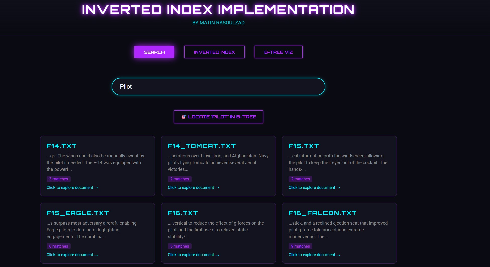
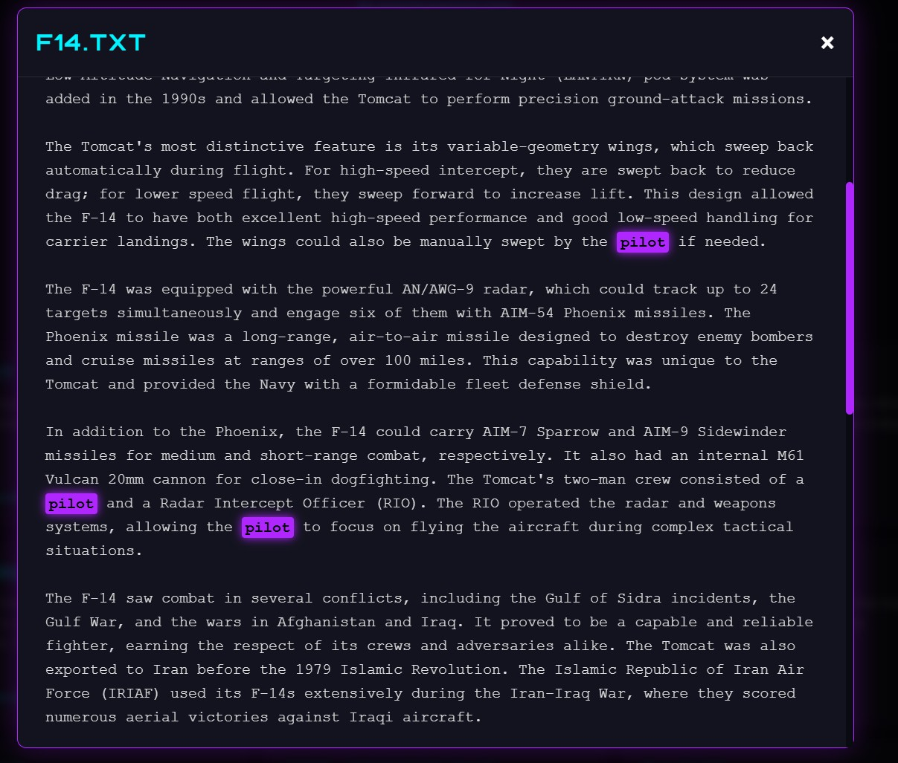
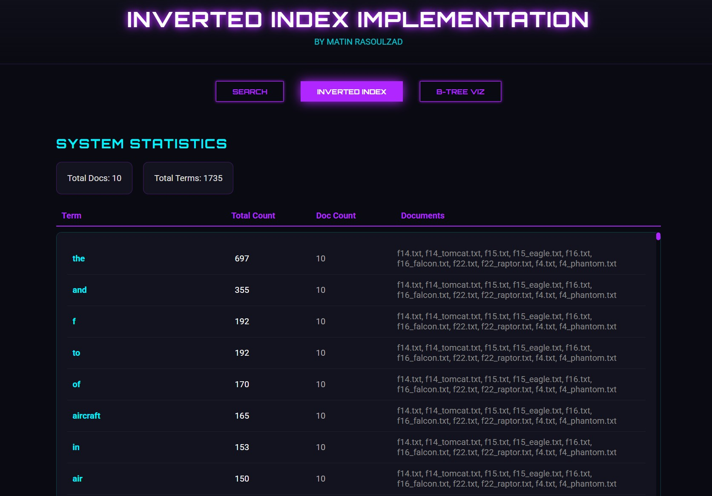
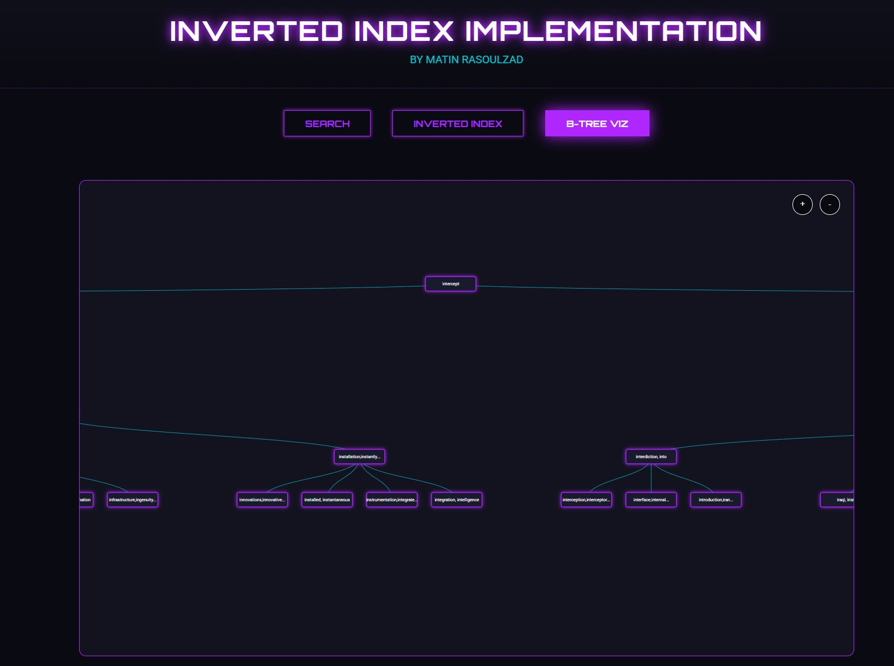
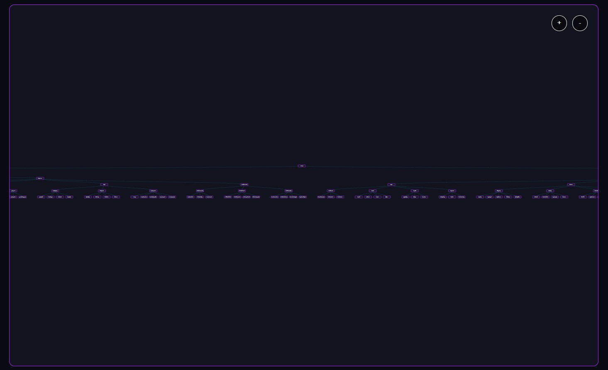

# Information Retrieval System
**Author:** Matin Rasoulzad  
**Date:** November 2025  
**Version:** 2.0  

## 💜 Overview
**This project** is a high-performance Information Retrieval (IR) System designed with a futuristic **Neon Cyberpunk** aesthetic. It features a robust **Inverted Index** and **B-Tree** data structure to efficiently index, search, and visualize document data.


The system offers two powerful interfaces:
1.  **Web Interface (Flask)**
2.  **Terminal Interface (CLI)**

---

## 📸 Gallery

### Interactive Search & Highlighting
The search system provides real-time results with context snippets. Clicking a result opens the document with the search term highlighted in neon.




### Inverted Index Visualization
View the complete inverted index sorted by frequency, giving you deep insights into the document corpus.



### Interactive B-Tree
A fully interactive D3.js visualization allows you to zoom, pan, and explore the B-Tree structure. Use the "Locate in B-Tree" feature to jump directly to a specific term node.




---

## 📂 Project Structure

### `app.py`
The **Flask Backend**.
*   Initializes the `IRSystem` class.
*   Serves the Web UI (`index.html`).
*   Provides API endpoints for search (`/api/search`), index statistics (`/api/index-data`), and B-Tree structure (`/api/btree-data`).
*   Handles document retrieval for the frontend modal.

### `Indexer_system.py`
The **Terminal CLI**.
*   A standalone, object-oriented implementation of the IR system.
*   Features a custom `NeonUI` class for colored terminal output (Magenta/Cyan).
*   Provides interactive search, stats display, and ASCII B-Tree visualization directly in your console.

### `templates/index.html`
The **Frontend**.
*   A single-file HTML/CSS/JS application.
*   **Design**: Dark mode with Neon Purple (`#b026ff`) and Cyan accents.
*   **Features**:
    *   **Search Tab**: Real-time results with "Locate in B-Tree" functionality.
    *   **Inverted Index Tab**: Frequency-sorted table of terms.
    *   **B-Tree Viz Tab**: Interactive D3.js graph with Zoom & Pan.
    *   **Doc Viewer**: Modal with automatic keyword highlighting.

### `documents/`
Contains the text corpus.
*   Includes detailed specs for **F-4, F-14, F-15, F-16, and F-22** fighter jets.

---

## 🚀 How to Run

### Prerequisites
Ensure you have Python installed. You will need the following libraries:
```bash
pip install flask colorama
```

### 1. Run the Web Application (Recommended)
Experience the full Neon UI with interactive visualizations.
```bash
python app.py
```
*   Open your browser to: **http://127.0.0.1:5000**
*   **Search**: Type "stealth" or "pilot".
*   **Explore**: Click "Locate in B-Tree" to see the node, or click a result to read the doc.

### 2. Run the Terminal CLI
Use the professional command-line interface for quick lookups and stats.
```bash
python Indexer_system.py
```
*   Follow the on-screen interactive prompts.
*   Type `exit` to quit.

---

## ✨ Features Checklist
- [x] **Inverted Index**: Maps terms to documents with frequency tracking.
- [x] **B-Tree**: Balanced tree structure for O(log n) search efficiency.
- [x] **Search**: Returns document matches, snippets, and hit counts.
- [x] **Visualization**: 
    - D3.js interactive graph (Web).
    - Hierarchical ASCII view (Terminal).
- [x] **Aesthetics**: Custom "Neon Dark" theme across both Web and Terminal.
